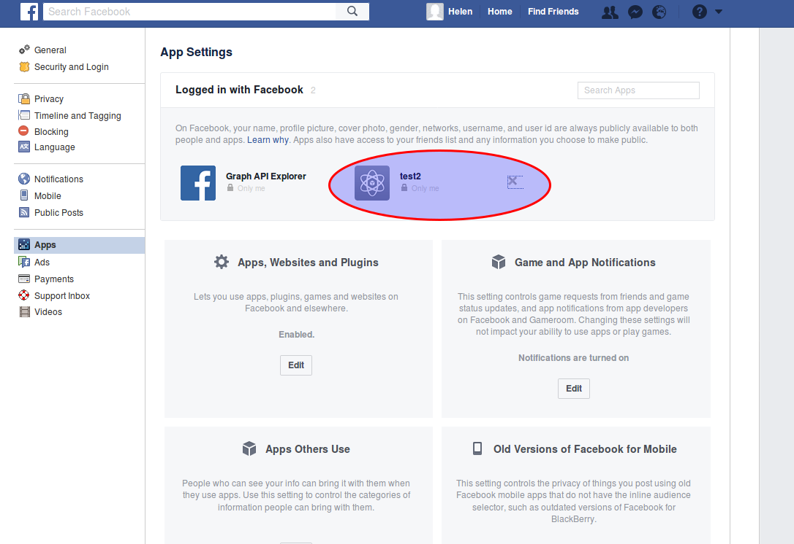
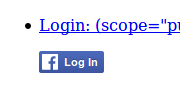
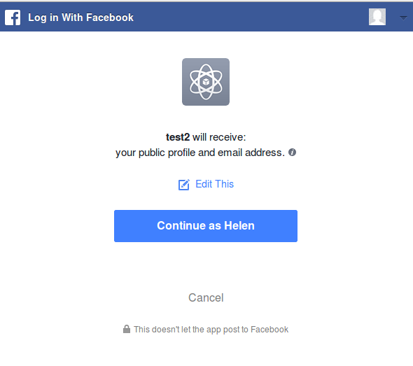
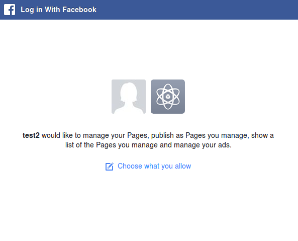
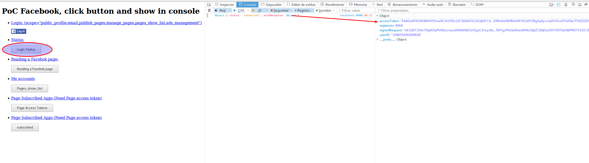
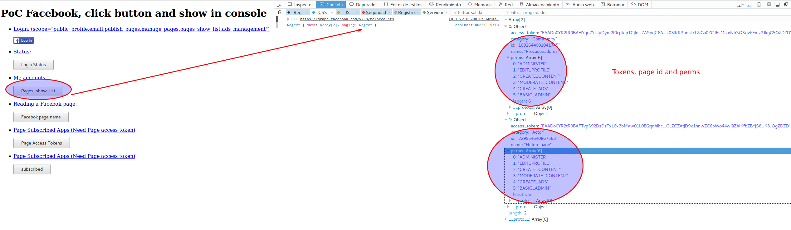
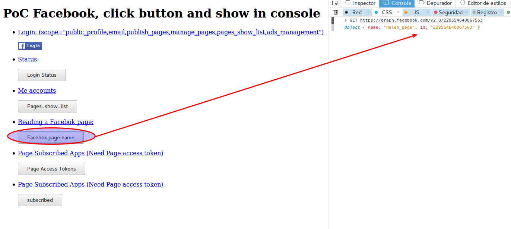
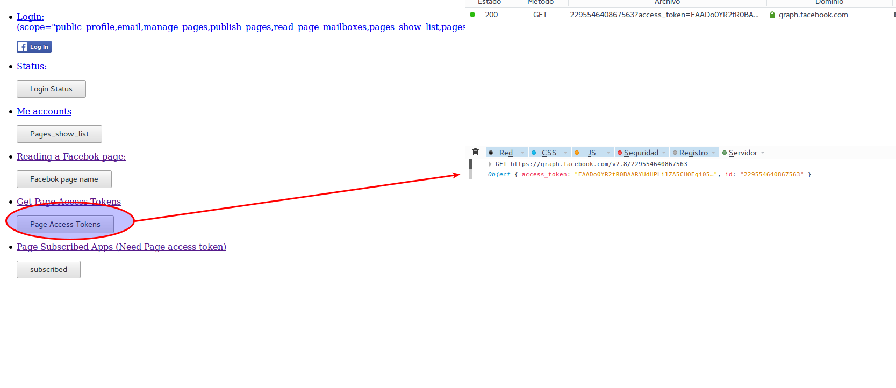
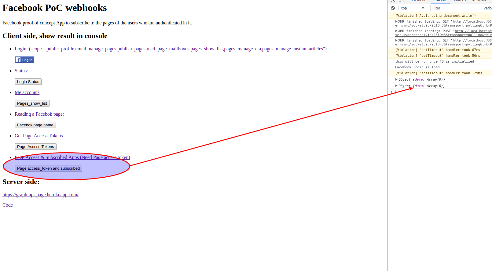

# Facebook PoC webhooks

Facebook proof of concept App to subscribe to the pages of the users who are authenticated in it.

## Client side, show result in console

* To start:
  * `npm install && npm start`

This example, use [test2 Facebook App](https://developers.facebook.com/apps/255986568181021/dashboard/) and _Helen Alagcefjffgfc Seligsteinescu_ [Test Users in Roles app](https://developers.facebook.com/apps/255986568181021/roles/test-users/)

* To test all flow, first delete test2 app permissions in _Helen_ :



 1. Login with Helen credentials, show with grant permissions:
  1. 

  2. Grant permissions:
      * 

      * 

 2. Check login status and get access_token:

 

 3. Show the Helen's Pages (page-id, user-tokens and perms):

 

 4. Show page name:

 

 5. **subscribed with page acces token ** `GET /{page-id}?fields=access_token`
 With JavaScript SDK:
 ```JavaScript
 FB.api(
      "/229554640867563?fields=access_token",
     function (response) {
       if (response && !response.error) {
         page_access_token=response.access_token
         FB.api(
              "/229554640867563/subscribed_apps?access_token=" + page_access_token,
             function (response) {
               if (response && !response.error) {
                 console.log(response);
               }
             }
         );
       }
     }
 );
 ```
And this is the response:

  

 **[Subscribed](https://developers.facebook.com/docs/graph-api/reference/page/subscribed_apps)**

 


## Server side:

* [Webhooks example code](https://github.com/fbsamples/graph-api-webhooks-samples/blob/master/heroku/index.js)
  * https://graph-api-page.herokuapp.com/


 ### Important

 [Permissions and App Review](https://developers.facebook.com/docs/facebook-login/permissions#reference-manage_pages)

Your app needs manage_pages and publish_pages permissions from the person who wants to post or message as a page. If your app request these permissions, then your app needs to go through Login Review.

**Your app might not need to request these permissions because people posting are already set up with a role in your app's dashboard.** If this is the case you do not need to submit your app for review. See the Roles tab in App Dashboard.
